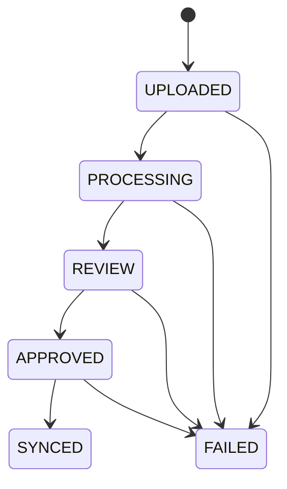
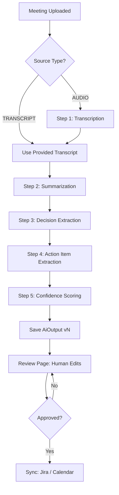
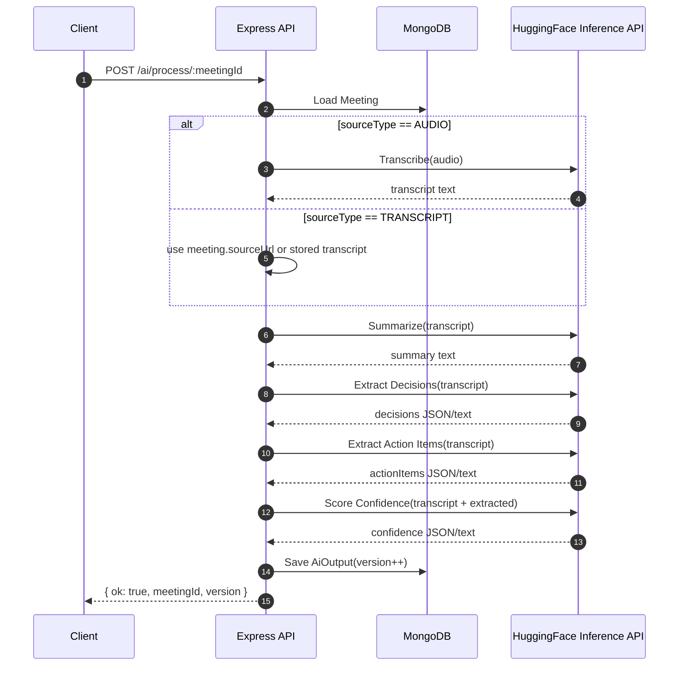
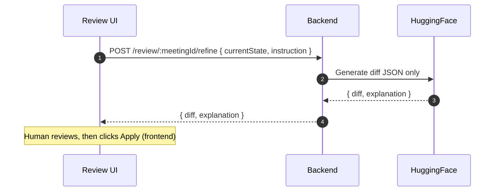

🧠 MeetOps Backend — Express.js Architecture (Frontend-First, AI-Centric)

Language: JavaScript (NO TypeScript)
Framework: Express.js
Database: MongoDB (Mongoose)
AI: HuggingFace Inference API
Scope: Backend that powers the MeetOps workflow
Philosophy: AI understands → Humans approve → Backend executes

1. Backend Role in MeetOps (Very Important)

The backend is not a chatbot server.
It is a workflow engine.
The backend must:
Accept meeting inputs
Run a deterministic AI pipeline
Store AI output as structured JSON
Allow humans to review & modify
Execute approved results to external tools
AI NEVER executes. Humans approve. Backend executes.

2. Tech Stack (Locked)
Core
Node.js (18+)
Express.js
MongoDB
Mongoose
Infra
Redis (optional but recommended)
BullMQ (background jobs)
AI
HuggingFace Inference API
One model per step (not one giant prompt)
External (mocked for hackathon)
JIRA REST API
Google Calendar API
SMTP / Email service

3. Backend Folder Structure
backend/
├── src/
│   ├── app.js                 # Express bootstrap
│   ├── server.js              # HTTP server
│
│   ├── config/
│   │   ├── env.js
│   │   ├── db.js
│   │   ├── redis.js
│   │   └── ai.js
│
│   ├── routes/
│   │   ├── auth.routes.js
│   │   ├── invite.routes.js
│   │   ├── workspace.routes.js
│   │   ├── meeting.routes.js
│   │   ├── ai.routes.js
│   │   ├── review.routes.js
│   │   ├── sync.routes.js
│   │   └── docs.routes.js
│
│   ├── controllers/
│   │   ├── auth.controller.js
│   │   ├── invite.controller.js
│   │   ├── workspace.controller.js
│   │   ├── meeting.controller.js
│   │   ├── ai.controller.js
│   │   ├── review.controller.js
│   │   ├── sync.controller.js
│   │   └── docs.controller.js
│
│   ├── services/
│   │   ├── ai/
│   │   │   ├── transcription.service.js
│   │   │   ├── summarization.service.js
│   │   │   ├── decision.service.js
│   │   │   ├── actionItem.service.js
│   │   │   └── confidence.service.js
│   │   │
│   │   ├── invite.service.js
│   │   ├── meeting.service.js
│   │   ├── review.service.js
│   │   ├── jira.service.js
│   │   ├── calendar.service.js
│   │   └── email.service.js
│
│   ├── models/
│   │   ├── User.js
│   │   ├── Workspace.js
│   │   ├── Invite.js
│   │   ├── Meeting.js
│   │   ├── AiOutput.js
│   │   ├── Review.js
│   │   ├── Integration.js
│   │   └── AuditLog.js
│
│   ├── queues/
│   │   ├── ai.queue.js
│   │   ├── sync.queue.js
│   │   └── email.queue.js
│
│   ├── middlewares/
│   │   ├── auth.middleware.js
│   │   ├── error.middleware.js
│   │   └── validate.middleware.js
│
│   ├── utils/
│   │   ├── logger.js
│   │   ├── promptBuilder.js
│   │   ├── jsonDiff.js
│   │   └── constants.js
│
│   └── seed/
│       └── seed.js
│
├── .env
├── package.json
└── README.md

-------------------------------------------------------------------------------

# Core Backend Services — Implementation Guide (Beginner Friendly)

You asked for the “core business logic” to be implemented in `services/`.
This is the condensed, non-repetitive version (see the Team Execution Plan at the end for exact per-dev steps + file lists).

Non-negotiables:
- Routes define URLs → controllers stay thin → services do the work (DB/queues/external APIs).
- AI produces JSON; humans approve; backend executes.
- Meetings must obey the state machine; no random state jumps.

### Architecture (mental model)
```mermaid
flowchart LR
  R[Route] --> C[Controller]
  C --> S[Service]
  S --> M[(MongoDB via Mongoose)]
  S --> Q[Queues (BullMQ)]
  S --> X[External APIs (mock ok)]
```

### Meeting status state machine (enforce this)
Allowed: `UPLOADED → PROCESSING → REVIEW → APPROVED → SYNCED` (or `FAILED`)


### Services to implement (controllers already call these)
- Auth: `src/services/auth.service.js` (signup/login)
- Workspace: `src/services/workspace.service.js` (get workspace + invite)
- Invites: `src/services/invite.service.js` + `src/services/email.service.js` (send/validate/accept)
- Meetings: `src/services/meeting.service.js` (upload/start/get)
- AI Orchestrator: `src/services/ai.service.js` (runs steps, saves `AiOutput`, moves to REVIEW)
- Review Gate: `src/services/review.service.js` (get/approve/refine-diff-only)
- Sync Executors: `src/services/jira.service.js`, `src/services/calendar.service.js` (only if APPROVED)
- Docs Bot: `src/services/docs.service.js` (static docs Q&A only)

Per-step AI services (one model per step):
- `src/services/ai/transcription.service.js`
- `src/services/ai/summarization.service.js`
- `src/services/ai/decision.service.js`
- `src/services/ai/actionItem.service.js`
- `src/services/ai/confidence.service.js`

### Tiny shared helpers (copy/paste)
```js
function httpError(statusCode, message) {
  const err = new Error(message);
  err.statusCode = statusCode;
  return err;
}

const allowedTransitions = {
  UPLOADED: ["PROCESSING", "FAILED"],
  PROCESSING: ["REVIEW", "FAILED"],
  REVIEW: ["APPROVED", "FAILED"],
  APPROVED: ["SYNCED", "FAILED"],
  SYNCED: [],
  FAILED: [],
};

function canTransition(from, to) {
  return (allowedTransitions[from] || []).includes(to);
}
```

### The only “workflow” rule to remember
AI writes draft JSON → review edits/approves → backend syncs.

-------------------------------------------------------------------------------

4. Database Models (MongoDB)
User
{
  email,
  name,
  role: "OWNER" | "MEMBER",
  workspaces: [workspaceId],
  createdAt
}

Workspace
{
  name,
  ownerId,
  members: [{ userId, role }],
  createdAt
}

Invite
{
  workspaceId,
  email,
  role,
  token,
  expiresAt,
  acceptedAt
}

Meeting
{
  workspaceId,
  createdBy,
  title,
  duration,
  participants,
  sourceType: "TRANSCRIPT" | "AUDIO",
  sourceUrl,
  status: "UPLOADED" | "PROCESSING" | "REVIEW" | "APPROVED" | "SYNCED" | "FAILED",
  createdAt
}

AI Output (Versioned)
{
  meetingId,
  version,
  summary,
  decisions,
  actionItems,
  confidenceScores,
  rawOutput,
  createdAt
}

Review
{
  meetingId,
  approvedBy,
  finalSummary,
  finalActionItems,
  approvedAt
}

Audit Log (DO NOT SKIP)
{
  actorId,
  action,
  entityType,
  entityId,
  metadata,
  timestamp
}

5. API Routes (Complete)
Auth
POST /auth/login
POST /auth/signup

Invites
POST /invites/send
GET  /invites/validate
POST /invites/accept

Workspace
GET  /workspace
POST /workspace/invite

Meetings
POST /meetings/upload
POST /meetings/:id/start
GET  /meetings/:id

AI Pipeline
POST /ai/process/:meetingId
GET  /ai/output/:meetingId

Review
GET  /review/:meetingId
POST /review/:meetingId/approve
POST /review/:meetingId/refine   // AI chatbot

Sync
POST /sync/:meetingId/jira
POST /sync/:meetingId/calendar

Docs Bot
POST /docs/ask

6. AI Pipeline (Critical)
Each step is separate, pure, and JSON-only.
Pipeline Order
Transcription (if audio)
Summarization
Decision extraction
Action item extraction
Confidence scoring
Output Contract
{
  "summary": [],
  "decisions": [],
  "actionItems": [
    {
      "title": "",
      "ownerHint": "",
      "confidence": 0.81
    }
  ]
}
No markdown. No prose. No emojis.

-------------------------------------------------------------------------------

# AI Pipeline — Implementation Guide (HuggingFace)

This section is written so a high‑school student can build the AI pipeline by following it step‑by‑step.

Goal:
- You have a meeting (transcript text or an audio file).
- The backend runs a deterministic pipeline.
- The backend saves structured JSON output.
- Humans review + approve.
- Only then the backend syncs to external tools.

IMPORTANT RULES (DO NOT BREAK)
1) AI outputs must be JSON-only (no markdown, no extra text).
2) Each pipeline step is separate (one model per step).
3) Never let AI directly execute actions (no auto-sync).
4) If JSON parse fails, treat it as an AI failure and stop the pipeline.

-------------------------------------------------------------------------------

## 6.1 The Big Picture (Text + Diagram)

Plain English:
1) Input meeting (transcript or audio).
2) If audio → transcribe it to text.
3) Summarize the transcript.
4) Extract decisions.
5) Extract action items.
6) Score confidence.
7) Save AI output as versioned JSON.
8) Human reviews/edits.
9) Human approves.
10) Backend syncs.

Mermaid flowchart (diagram):


-------------------------------------------------------------------------------

## 6.2 What You Need (Minimal Setup)

### HuggingFace Token
1) Create a HuggingFace account.
2) Create an access token.
3) Put it in `.env`:

```
HF_API_TOKEN=hf_xxxxxxxxxxxxxxxxxxxxxxxxx
```

### Inference Endpoint (the API you call)
HuggingFace Inference API base pattern:

```
POST https://api-inference.huggingface.co/models/{MODEL_ID}
Authorization: Bearer <HF_API_TOKEN>
```

Notes:
- The exact output format depends on the model/task.
- For this project, we always transform model output into our own strict JSON contract.

-------------------------------------------------------------------------------

## 6.3 Pick Models (One per Step)

You can swap models later. Start with simple, popular models.

Recommended starter set (examples):
- Transcription (audio → text): `openai/whisper-small` (or any Whisper variant)
- Summarization: `facebook/bart-large-cnn` (good beginner summarizer)
- Extraction (decisions + actions): an instruction-following text-generation model that can output JSON
  - Example: `google/flan-t5-base` (works for instruction tasks; output is plain text)

Reality check:
- Some models may rate limit or be slow on free tiers.
- If a model is gated or unavailable, pick a similar one.

-------------------------------------------------------------------------------

## 6.4 The Strict Data Contracts (What You Save)

### 6.4.1 Transcript Contract
At the end of transcription step, you must have:

```json
{
  "transcriptText": "...full transcript as a single string...",
  "language": "en",
  "durationSeconds": 1234
}
```

### 6.4.2 AI Output Contract (Versioned)
This is what the pipeline produces and saves in `AiOutput`.

```json
{
  "summary": ["..."],
  "decisions": ["..."],
  "actionItems": [
    {
      "title": "...",
      "ownerHint": "...",
      "confidence": 0.81
    }
  ],
  "confidenceScores": {
    "summary": 0.9,
    "decisions": 0.8,
    "actionItems": 0.75
  },
  "rawOutput": {
    "summarization": "...",
    "decisionExtraction": "...",
    "actionExtraction": "..."
  }
}
```

Hard rules:
- `confidence` is always a number 0..1
- arrays always exist (empty array if nothing found)

-------------------------------------------------------------------------------

## 6.5 How `/ai/process/:meetingId` Works (Step-by-Step)

This endpoint runs the entire pipeline for one meeting.

Mermaid sequence diagram:


-------------------------------------------------------------------------------

## 6.6 Calling HuggingFace (Copy/Paste JS)

This is a minimal pattern for calling HF Inference API from Node.
This is documentation only (not production-hardening).

```js
// Minimal HF caller (Node 18+)
async function callHfModel({ modelId, payload, token }) {
  const res = await fetch(`https://api-inference.huggingface.co/models/${modelId}`, {
    method: "POST",
    headers: {
      Authorization: `Bearer ${token}`,
      "Content-Type": "application/json",
    },
    body: JSON.stringify(payload),
  });

  // 503 can happen when model is loading. You should retry with backoff in real code.
  const data = await res.json();
  return { status: res.status, data };
}
```

-------------------------------------------------------------------------------

## 6.7 Prompt Templates (Make the Model Output JSON)

Even when using text-generation models, you MUST force a strict JSON output.

### Template Rules
Always include:
- "Return ONLY valid JSON"
- "No markdown"
- Provide an exact JSON schema example
- Ask for empty arrays if nothing found

### 6.7.1 Decisions Extraction Prompt
```text
You are an information extraction engine.
Return ONLY valid JSON. No markdown. No extra text.

From the transcript below, extract decisions as concise bullet-like strings.

Return JSON exactly like:
{
  "decisions": ["..."]
}

If there are no decisions, return:
{
  "decisions": []
}

TRANSCRIPT:
<<<
{TRANSCRIPT_TEXT}
>>>
```

### 6.7.2 Action Item Extraction Prompt
```text
You are an information extraction engine.
Return ONLY valid JSON. No markdown. No extra text.

Extract action items from the transcript.
Each action item must include:
- title: short imperative task
- ownerHint: person/team name if mentioned, otherwise empty string

Return JSON exactly like:
{
  "actionItems": [
    { "title": "...", "ownerHint": "..." }
  ]
}

If none:
{ "actionItems": [] }

TRANSCRIPT:
<<<
{TRANSCRIPT_TEXT}
>>>
```

### 6.7.3 Summary Prompt
```text
You are a summarization engine.
Return ONLY valid JSON. No markdown. No extra text.

Summarize the transcript into 3 to 7 short sentences.

Return JSON exactly like:
{ "summary": ["...", "..."] }

TRANSCRIPT:
<<<
{TRANSCRIPT_TEXT}
>>>
```

-------------------------------------------------------------------------------

## 6.8 Parsing: “JSON-Only” Enforcement

The most common beginner failure is the model returning extra text.
Your pipeline must treat that as an error.

Simple approach:
1) Take model output as string.
2) Try `JSON.parse`.
3) If it fails, fail the pipeline step.

```js
function mustParseJson(text) {
  return JSON.parse(text);
}
```

If you want a slightly more forgiving approach (still safe), you can attempt to extract the first `{...}` block.
But remember: forgiving parsing can hide AI mistakes.

-------------------------------------------------------------------------------

## 6.9 Confidence Scoring (Two Beginner-Friendly Options)

Option A (recommended for beginners): Ask the model for confidence numbers.

Prompt idea:
```text
Return ONLY valid JSON.
Given the extracted objects, score confidence 0..1.

Return:
{
  "confidenceScores": {
    "summary": 0.0,
    "decisions": 0.0,
    "actionItems": 0.0
  },
  "actionItemConfidences": [0.0]
}
```

Option B (simple heuristic, no model call):
- If transcript is very short, reduce confidence.
- If actionItems length is 0, confidence for actionItems is 0.2.

The README requires a “confidence” per action item in the final contract. Option A fits best.

-------------------------------------------------------------------------------

## 6.10 Failure Modes (What to Do)

HuggingFace can fail for boring reasons. Plan for these:

1) Model loading (often HTTP 503)
- Retry with exponential backoff (e.g., 1s, 2s, 4s, 8s).

2) Rate limiting
- Slow down, retry later, or switch to a smaller model.

3) Invalid JSON
- Stop pipeline, set meeting.status = FAILED, store raw output for debugging.

4) Partial outputs
- Empty arrays are allowed.
- Missing required fields is NOT allowed.

-------------------------------------------------------------------------------

## 6.11 Versioning AI Output

Every time the pipeline runs successfully, create a new `AiOutput` record:
- `meetingId`: the meeting
- `version`: increment (1, 2, 3...)
- store both structured fields and `rawOutput`

This enables:
- re-running the pipeline
- comparing versions during review

-------------------------------------------------------------------------------

7. Review AI Chatbot
Used ONLY on /review page
Purpose:
Refine extracted JSON
Merge, reprioritize, clarify
Input:

{
  "currentState": {...},
  "instruction": "merge duplicates"
}
Output:
{
  "diff": {...},
  "explanation": "Merged 2 overlapping tasks"
}
Backend must:
Show diff
Never auto-apply

-------------------------------------------------------------------------------

## 7.1 Review Bot “Refine” Contract (Beginner Friendly)

Endpoint:
- `POST /review/:meetingId/refine`

Input body:
```json
{
  "currentState": {
    "summary": [],
    "decisions": [],
    "actionItems": []
  },
  "instruction": "merge duplicates and rewrite action items more clearly"
}
```

Output body:
```json
{
  "diff": {
    "added": [],
    "removed": [],
    "changed": []
  },
  "explanation": "Merged 2 overlapping tasks"
}
```

CRITICAL:
- The refine bot must NEVER auto-apply.
- The UI shows diff + explanation.
- Human decides whether to accept.

Mermaid diagram:


8. Docs Bot (DOT)
This bot:
Reads static markdown
Explains workflow
Answers “why” questions
It must:
Never touch meetings
Never touch AI outputs
Never modify data

9. Queues & Background Jobs
AI Queue
Runs pipeline
Saves output
Updates meeting status
Sync Queue
Creates JIRA tickets
Creates Calendar events
Email Queue
Sends invites
Sends notifications

10. Redis Usage (Minimal & Smart)
Use Redis for:
Invite token validation
Job progress
Streaming cursors
❌ Do NOT store meetings or AI data in Redis

11. Team Work Division
Dev 1: Auth + Invites + Workspace
Dev 2: Meetings + Upload + State machine
Dev 3: AI pipeline + Review bot + Docs bot
Dev 4: Sync + Queues + Audit logs

12. What NOT to Build (Seriously)
No dashboards
No analytics
No Kafka
No auto-execution
No “smart suggestions” outside review


-------------------------------------------------------------------------------


# Team Execution Plan (4 Devs) — Exact Tasks, Files, Steps, and Code Size

You said you split the backend + AI into tasks for a team of 4.
This section is the exact implementation checklist.

Important notes before you start:
- The repo already has scaffolding for `src/models/`, `src/routes/`, `src/controllers/`.
- Your job now is to implement runtime wiring + the `src/services/` logic.
- Keep controllers THIN: services do the work.
- Keep AI JSON-only.
- Any “external integrations” (Jira/Calendar/Email) can be mocked for hackathon.

How to use this plan:
- Each dev owns a set of files.
- Each dev can implement in parallel.
- Each task contains: what to do, where to do it, and approx LOC.

-------------------------------------------------------------------------------

## Dev 1 — Auth + Invites + Workspace (Foundation)

Goal: Make auth and onboarding flow work end-to-end with MongoDB.

### Task 1.1 — Add server bootstrap + route mounting
Files:
- `backend/src/app.js` (create)
- `backend/src/server.js` (create)
- `backend/src/config/env.js` (create)
- `backend/src/config/db.js` (create)

Steps:
1) Create Express app in `src/app.js`.
2) Add JSON body parsing.
3) Mount routers:
  - `/auth` → `routes/auth.routes.js`
  - `/invites` → `routes/invite.routes.js`
  - `/workspace` → `routes/workspace.routes.js`
  - `/meetings` → `routes/meeting.routes.js`
  - `/ai` → `routes/ai.routes.js`
  - `/review` → `routes/review.routes.js`
  - `/sync` → `routes/sync.routes.js`
  - `/docs` → `routes/docs.routes.js`
4) Create `src/config/db.js` that connects mongoose using `MONGO_URI`.
5) Create `src/server.js` that calls `connectDb()` and starts listening.

Approx code size:
- `app.js`: ~40–80 LOC
- `server.js`: ~25–60 LOC
- `config/env.js`: ~15–40 LOC
- `config/db.js`: ~25–60 LOC

### Task 1.2 — Implement Auth service (minimal hackathon auth)
Files:
- `backend/src/services/auth.service.js` (create)
- (optional) `backend/src/middlewares/auth.middleware.js` (create later; keep minimal)

Steps:
1) Implement `exports.signup(body)`:
  - Create a User (`models/User.js`).
  - Return `{ user }`.
2) Implement `exports.login(body)`:
  - Find user by email.
  - If not found, throw 401.
  - Return `{ user }`.

Approx code size:
- `auth.service.js`: ~60–120 LOC

### Task 1.3 — Implement Workspace + Invite services
Files:
- `backend/src/services/workspace.service.js` (create)
- `backend/src/services/invite.service.js` (create)
- `backend/src/services/email.service.js` (create, mocked)

Steps (workspace):
1) Implement `getWorkspace(req)`:
  - Decide how you get userId (temporary header or `req.user`).
  - Return workspaces the user belongs to.
2) Implement `invite(body)`:
  - Delegate to `inviteService.send(body)`.

Steps (invite):
1) Implement `send(body)`:
  - Generate token.
  - Create Invite doc.
  - Call `emailService.sendInvite(...)` (mock ok).
2) Implement `validate(query)`:
  - Validate token exists, not expired, not accepted.
3) Implement `accept(body)`:
  - Mark accepted.
  - Add member to workspace.
  - Create user if needed (hackathon friendly).

Approx code size:
- `workspace.service.js`: ~60–140 LOC
- `invite.service.js`: ~140–260 LOC
- `email.service.js`: ~30–80 LOC

Done criteria:
- You can signup/login.
- You can create and accept invites.
- `/workspace` returns something real from Mongo.

-------------------------------------------------------------------------------

## Dev 2 — Meetings + Upload + State Machine

Goal: Meeting upload + meeting retrieval + correct state transitions.

### Task 2.1 — Meeting service implementation
Files:
- `backend/src/services/meeting.service.js` (create)

Steps:
1) Implement `upload(body)`:
  - Create Meeting with status `UPLOADED`.
  - Save basic metadata (title, participants, sourceType, sourceUrl).
2) Implement `start(meetingId)`:
  - Load meeting.
  - Enforce meeting.status == `UPLOADED`.
  - Set status → `PROCESSING`.
  - Trigger pipeline (call `aiService.process(meetingId)` OR enqueue job).
  - Return `{ ok: true, meetingId }`.
3) Implement `getById(meetingId)`:
  - Return Meeting.
  - (Optional) also return latest AiOutput and/or Review.

Approx code size:
- `meeting.service.js`: ~120–220 LOC

### Task 2.2 — Status transition guard (shared)
Files (choose one approach):
- Option A: `backend/src/utils/constants.js` (add allowed transitions)
- Option B: `backend/src/services/_helpers/status.js` (create helper)

Steps:
1) Implement a reusable `canTransition(from, to)`.
2) Use it in meeting start + AI process + review approve + sync.

Approx code size:
- ~30–80 LOC

Done criteria:
- Meetings cannot skip states.
- “Start processing” fails if not `UPLOADED`.

-------------------------------------------------------------------------------

## Dev 3 — AI Pipeline + Review Bot + Docs Bot

Goal: Make the deterministic AI pipeline run and produce versioned JSON outputs.

### Task 3.1 — Implement AI Orchestrator service
Files:
- `backend/src/services/ai.service.js` (create)

Steps:
1) Load meeting.
2) Get transcriptText:
  - If AUDIO: call transcription service.
  - If TRANSCRIPT: use sourceUrl as transcript text (hackathon shortcut).
3) Call each step service (summarization → decisions → action items → confidence).
4) Validate the JSON contract shape (arrays exist).
5) Save `AiOutput` with incremented version.
6) Update meeting status to `REVIEW`.

Approx code size:
- `ai.service.js`: ~180–320 LOC

### Task 3.2 — Implement per-step AI services (HF Inference API)
Files:
- `backend/src/config/ai.js` (create)
- `backend/src/services/ai/transcription.service.js` (create)
- `backend/src/services/ai/summarization.service.js` (create)
- `backend/src/services/ai/decision.service.js` (create)
- `backend/src/services/ai/actionItem.service.js` (create)
- `backend/src/services/ai/confidence.service.js` (create)

Steps:
1) In `config/ai.js`, store:
  - token env var `HF_API_TOKEN`
  - model IDs per step
2) For each step service:
  - implement exactly ONE exported method:
    - transcription: `transcribe({ sourceUrl })`
    - summarization: `summarize({ transcriptText })`
    - decision: `extract({ transcriptText })`
    - actionItem: `extract({ transcriptText })`
    - confidence: `score({ transcriptText, summary, decisions, actionItems })`
3) Enforce JSON-only parsing:
  - if parse fails → throw error
4) Return objects that match the contracts in section 6.

Approx code size:
- `config/ai.js`: ~40–90 LOC
- each AI step service: ~80–180 LOC
- total for step services: ~400–900 LOC

### Task 3.3 — Review refine bot (diff-only)
Files:
- `backend/src/services/review.service.js` (create)
- (optional) `backend/src/utils/jsonDiff.js` (create helper)

Steps:
1) Implement `get(meetingId)`:
  - return meeting + latest AiOutput + existing Review.
2) Implement `approve(meetingId, body)`:
  - require meeting.status == `REVIEW`
  - save Review
  - set meeting.status → `APPROVED`
3) Implement `refine(meetingId, body)`:
  - call HF “refine” prompt
  - return `{ diff, explanation }`
  - NEVER auto-apply

Approx code size:
- `review.service.js`: ~180–340 LOC
- `jsonDiff.js` helper: ~80–200 LOC

### Task 3.4 — Docs Bot (DOT)
Files:
- `backend/src/services/docs.service.js` (create)
- `backend/src/utils/promptBuilder.js` (optional)
- `backend/src/docs/` (create markdown files; optional)

Steps:
1) Load static markdown files.
2) Build a prompt “answer from docs only”.
3) Call HF model.
4) Return an answer.

Hard constraints:
- Must NOT read meetings.
- Must NOT read AI outputs.
- Must NOT modify data.

Approx code size:
- `docs.service.js`: ~150–300 LOC

Done criteria:
- `POST /ai/process/:meetingId` creates `AiOutput`.
- `GET /ai/output/:meetingId` returns latest version.
- `POST /review/:meetingId/refine` returns diff-only.
- `POST /docs/ask` answers from static docs.

-------------------------------------------------------------------------------

## Dev 4 — Sync + Queues + Audit Logs

Goal: After approval, create external outputs (mock ok) and track everything.

### Task 4.1 — Implement Sync services
Files:
- `backend/src/services/jira.service.js` (create)
- `backend/src/services/calendar.service.js` (create)

Steps:
1) For each sync method:
  - Verify meeting.status == `APPROVED`.
  - Load Review (approved data).
  - Create mock objects (or real API calls if available).
  - Return `{ ok: true, created: [...] }`.
2) Decide how meeting.status becomes `SYNCED`:
  - either after each sync, or after both complete.

Approx code size:
- `jira.service.js`: ~120–260 LOC
- `calendar.service.js`: ~120–260 LOC

### Task 4.2 — Queues (BullMQ) integration (recommended)
Files:
- `backend/src/config/redis.js` (create)
- `backend/src/queues/ai.queue.js` (create)
- `backend/src/queues/sync.queue.js` (create)
- `backend/src/queues/email.queue.js` (create)

Steps:
1) Configure Redis connection.
2) For AI:
  - `meeting.start` enqueues a job.
  - worker runs `aiService.process(meetingId)`.
3) For Sync:
  - `sync.controller` enqueues job.
  - worker calls jira/calendar services.
4) For Email:
  - invite service enqueues email job.

Approx code size:
- `redis.js`: ~40–90 LOC
- each queue file: ~120–260 LOC
- total: ~400–900 LOC

### Task 4.3 — Audit logging everywhere
Files:
- `backend/src/services/audit.service.js` (create)
- (touch other services to call audit log)

Steps:
1) Implement `auditService.log({ actorId, action, entityType, entityId, metadata })`.
2) Add calls in:
  - invite.send / accept
  - meeting.upload / start
  - ai.process success/fail
  - review.approve
  - sync.jira / sync.calendar

Approx code size:
- `audit.service.js`: ~40–90 LOC
- audit calls sprinkled across services: ~40–120 LOC

Done criteria:
- You can trigger sync after approval.
- Jobs can run async (optional but recommended).
- AuditLog records are created for key actions.

-------------------------------------------------------------------------------

## Final Integration Checklist (Everyone)

1) Add `.env` keys:
  - `PORT`
  - `MONGO_URI`
  - `HF_API_TOKEN`
  - (optional) `REDIS_URL`
2) Update `backend/package.json` dependencies (Express, Mongoose, BullMQ, Redis, etc.).
3) Ensure route prefixes match the README:
  - `/auth/*`, `/invites/*`, `/workspace/*`, `/meetings/*`, `/ai/*`, `/review/*`, `/sync/*`, `/docs/*`
4) Manual happy-path test sequence:
  - signup → create workspace → send invite → accept invite
  - upload meeting (TRANSCRIPT) → start → ai output created → review approve → sync

-------------------------------------------------------------------------------