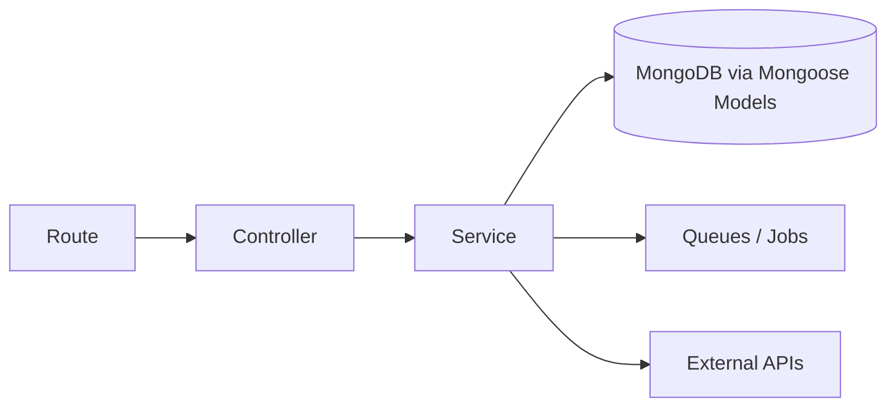
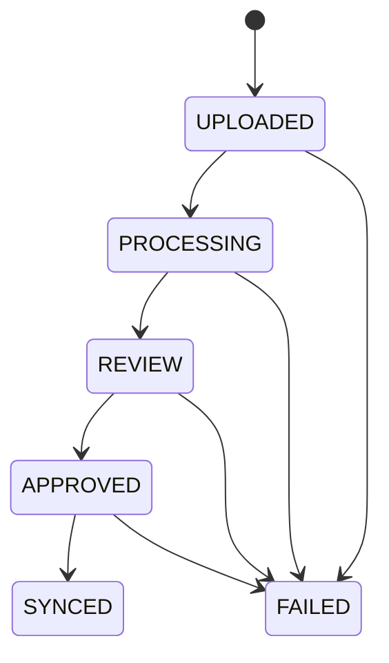
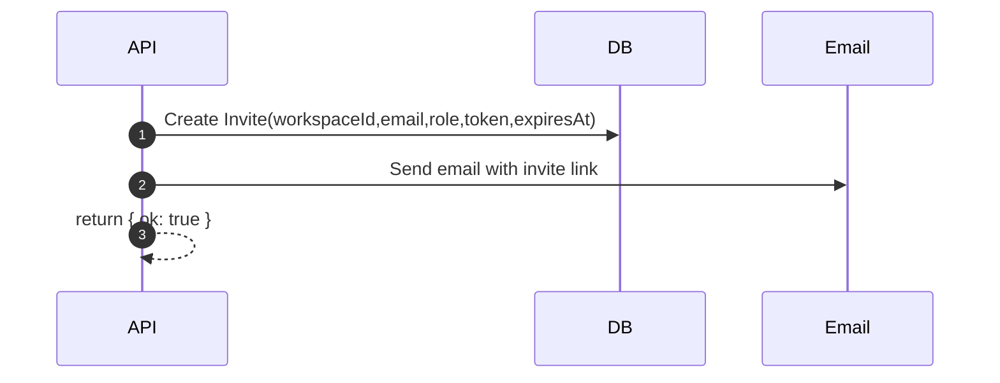
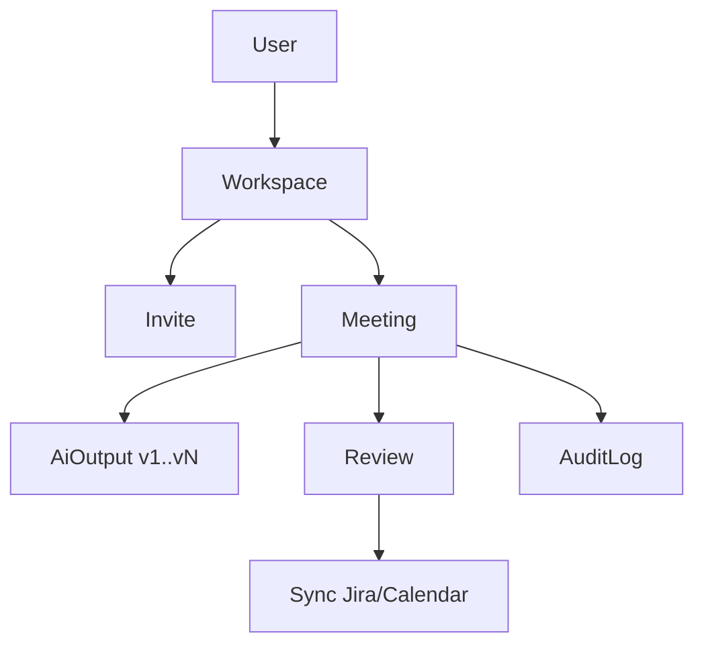
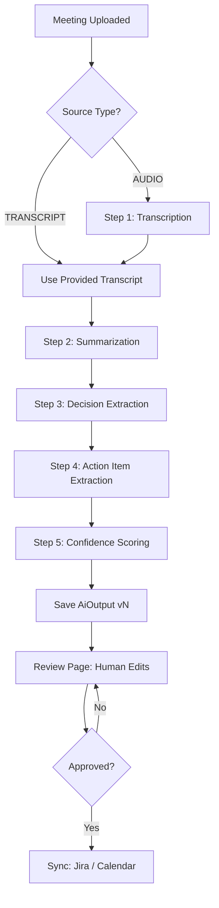
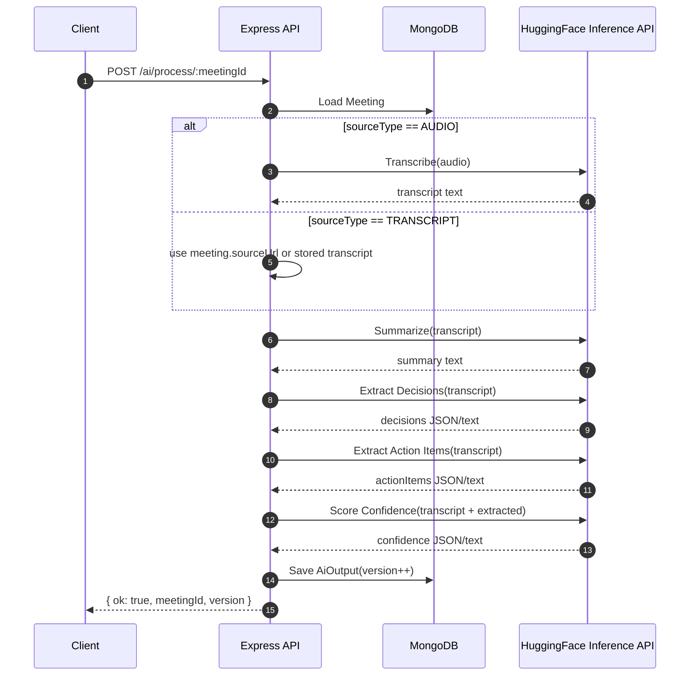
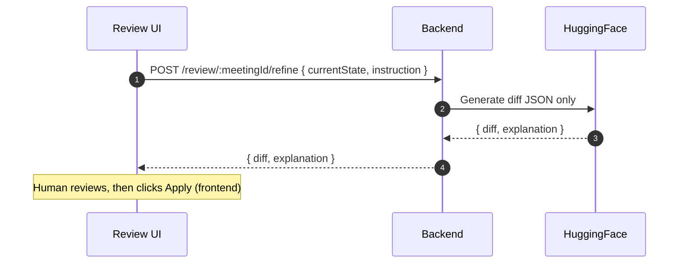

🧠 MeetOps Backend — Express.js Architecture (Frontend-First, AI-Centric)

Language: JavaScript (NO TypeScript)
Framework: Express.js
Database: MongoDB (Mongoose)
AI: HuggingFace Inference API
Scope: Backend that powers the MeetOps workflow
Philosophy: AI understands → Humans approve → Backend executes

1. Backend Role in MeetOps (Very Important)

The backend is not a chatbot server.
It is a workflow engine.
The backend must:
Accept meeting inputs
Run a deterministic AI pipeline
Store AI output as structured JSON
Allow humans to review & modify
Execute approved results to external tools
AI NEVER executes. Humans approve. Backend executes.

2. Tech Stack (Locked)
Core
Node.js (18+)
Express.js
MongoDB
Mongoose
Infra
Redis (optional but recommended)
BullMQ (background jobs)
AI
HuggingFace Inference API
One model per step (not one giant prompt)
External (mocked for hackathon)
JIRA REST API
Google Calendar API
SMTP / Email service

3. Backend Folder Structure
backend/
├── src/
│   ├── app.js                 # Express bootstrap
│   ├── server.js              # HTTP server
│
│   ├── config/
│   │   ├── env.js
│   │   ├── db.js
│   │   ├── redis.js
│   │   └── ai.js
│
│   ├── routes/
│   │   ├── auth.routes.js
│   │   ├── invite.routes.js
│   │   ├── workspace.routes.js
│   │   ├── meeting.routes.js
│   │   ├── ai.routes.js
│   │   ├── review.routes.js
│   │   ├── sync.routes.js
│   │   └── docs.routes.js
│
│   ├── controllers/
│   │   ├── auth.controller.js
│   │   ├── invite.controller.js
│   │   ├── workspace.controller.js
│   │   ├── meeting.controller.js
│   │   ├── ai.controller.js
│   │   ├── review.controller.js
│   │   ├── sync.controller.js
│   │   └── docs.controller.js
│
│   ├── services/
│   │   ├── ai/
│   │   │   ├── transcription.service.js
│   │   │   ├── summarization.service.js
│   │   │   ├── decision.service.js
│   │   │   ├── actionItem.service.js
│   │   │   └── confidence.service.js
│   │   │
│   │   ├── invite.service.js
│   │   ├── meeting.service.js
│   │   ├── review.service.js
│   │   ├── jira.service.js
│   │   ├── calendar.service.js
│   │   └── email.service.js
│
│   ├── models/
│   │   ├── User.js
│   │   ├── Workspace.js
│   │   ├── Invite.js
│   │   ├── Meeting.js
│   │   ├── AiOutput.js
│   │   ├── Review.js
│   │   ├── Integration.js
│   │   └── AuditLog.js
│
│   ├── queues/
│   │   ├── ai.queue.js
│   │   ├── sync.queue.js
│   │   └── email.queue.js
│
│   ├── middlewares/
│   │   ├── auth.middleware.js
│   │   ├── error.middleware.js
│   │   └── validate.middleware.js
│
│   ├── utils/
│   │   ├── logger.js
│   │   ├── promptBuilder.js
│   │   ├── jsonDiff.js
│   │   └── constants.js
│
│   └── seed/
│       └── seed.js
│
├── .env
├── package.json
└── README.md

-------------------------------------------------------------------------------

# Core Backend Services — Implementation Guide (Beginner Friendly)

You asked for the “core business logic” to be implemented in `services/`.
This section explains exactly what to write there, step-by-step, with diagrams and copy/paste JS skeletons.

IMPORTANT:
- This README describes the logic; it does NOT auto-create those service files.
- Controllers stay thin (already done): controllers call services and return JSON.
- Services contain ALL workflow logic and DB reads/writes.
- Models are dumb schemas (already done).

-------------------------------------------------------------------------------

## S1. Golden Rule: Route → Controller → Service

Mental model:
- Route defines URL + method.
- Controller reads `req` and calls a service.
- Service does the work (DB, queues, external APIs).

Diagram:


Controller pattern (already used in this repo):
```js
// controllers are thin
exports.someHandler = async (req, res, next) => {
  try {
    const result = await someService.someMethod(req.body, req.params, req.query);
    return res.json(result);
  } catch (err) {
    return next(err);
  }
};
```

-------------------------------------------------------------------------------

## S2. Meeting Status State Machine (Core Business Rule)

Meetings move through states. Do NOT allow random jumps.

Allowed statuses (from README):
`UPLOADED → PROCESSING → REVIEW → APPROVED → SYNCED` (or `FAILED` at any point)

Diagram:


Simple rule examples:
- `/meetings/:id/start` can only run if meeting.status is `UPLOADED`.
- `/ai/process/:meetingId` should set status to `PROCESSING` before work.
- After AI output is saved, set status to `REVIEW`.
- `/review/:meetingId/approve` sets status to `APPROVED`.
- `/sync/...` should only run if status is `APPROVED`.

-------------------------------------------------------------------------------

## S3. The Services You Should Implement

These are the “core business logic” files.

Recommended service files (minimum):
- `src/services/auth.service.js`
- `src/services/workspace.service.js`
- `src/services/invite.service.js`
- `src/services/meeting.service.js`
- `src/services/ai.service.js` (or use queue to run AI)
- `src/services/review.service.js`
- `src/services/jira.service.js`
- `src/services/calendar.service.js`
- `src/services/email.service.js`
- `src/services/docs.service.js`

Plus the per-step AI services already listed:
- `src/services/ai/transcription.service.js`
- `src/services/ai/summarization.service.js`
- `src/services/ai/decision.service.js`
- `src/services/ai/actionItem.service.js`
- `src/services/ai/confidence.service.js`

Why this matters:
- Each file does ONE category of work.
- Your controllers already require these modules.

-------------------------------------------------------------------------------

## S4. Shared Helpers (You Can Copy These)

### S4.1 A tiny “assert” helper
```js
function assert(condition, message) {
  if (!condition) {
    const err = new Error(message);
    err.statusCode = 400;
    throw err;
  }
}
```

### S4.2 A safe meeting status transition helper
```js
const allowedTransitions = {
  UPLOADED: ["PROCESSING", "FAILED"],
  PROCESSING: ["REVIEW", "FAILED"],
  REVIEW: ["APPROVED", "FAILED"],
  APPROVED: ["SYNCED", "FAILED"],
  SYNCED: [],
  FAILED: [],
};

function canTransition(from, to) {
  return (allowedTransitions[from] || []).includes(to);
}
```

-------------------------------------------------------------------------------

## S5. Auth Service (Minimal UI-Auth for Hackathon)

Routes:
- `POST /auth/login`
- `POST /auth/signup`

What the service should do (beginner steps):
1) Read email/name.
2) For signup: create a User.
3) For login: find user by email.
4) Return a simple JSON session payload.

Service skeleton:
```js
// src/services/auth.service.js
const User = require("../models/User");

exports.signup = async (body) => {
  // 1) validate input (minimal)
  // 2) create user
  // 3) return { user }
  const user = await User.create({
    email: body.email,
    name: body.name,
    role: body.role || "MEMBER",
  });
  return { user };
};

exports.login = async (body) => {
  const user = await User.findOne({ email: body.email });
  // For hackathon: if not found, throw a 401
  if (!user) {
    const err = new Error("Invalid credentials");
    err.statusCode = 401;
    throw err;
  }
  return { user };
};
```

-------------------------------------------------------------------------------

## S6. Workspace Service

Routes:
- `GET /workspace`
- `POST /workspace/invite`

Beginner logic:
1) Determine “current user” (later via auth middleware; for now can be a placeholder).
2) `GET /workspace`: return the workspace(s) user belongs to.
3) `POST /workspace/invite`: delegate to Invite service.

Service skeleton:
```js
// src/services/workspace.service.js
const Workspace = require("../models/Workspace");
const inviteService = require("./invite.service");

exports.getWorkspace = async (req) => {
  // For hackathon, you might pass userId via header or req.user
  const userId = req.user?.id;
  if (!userId) {
    const err = new Error("Missing user context");
    err.statusCode = 401;
    throw err;
  }

  const workspaces = await Workspace.find({ "members.userId": userId });
  return { workspaces };
};

exports.invite = async (body) => {
  return inviteService.send(body);
};
```

-------------------------------------------------------------------------------

## S7. Invite Service

Routes:
- `POST /invites/send`
- `GET /invites/validate`
- `POST /invites/accept`

Beginner logic (clean and simple):
1) `send`: create an Invite document with a random token and expiry.
2) `validate`: check token exists and not expired and not accepted.
3) `accept`: mark acceptedAt, add user to workspace members.

Sequence diagram:


Service skeleton:
```js
// src/services/invite.service.js
const crypto = require("crypto");
const Invite = require("../models/Invite");
const Workspace = require("../models/Workspace");
const User = require("../models/User");
const emailService = require("./email.service");

exports.send = async (body) => {
  const token = crypto.randomBytes(24).toString("hex");
  const expiresAt = new Date(Date.now() + 1000 * 60 * 60 * 24); // 24h

  const invite = await Invite.create({
    workspaceId: body.workspaceId,
    email: body.email,
    role: body.role,
    token,
    expiresAt,
  });

  await emailService.sendInvite({ to: invite.email, token });
  return { inviteId: invite._id, token };
};

exports.validate = async (query) => {
  const invite = await Invite.findOne({ token: query.token });
  if (!invite) {
    const err = new Error("Invalid token");
    err.statusCode = 400;
    throw err;
  }
  if (invite.acceptedAt) {
    const err = new Error("Invite already accepted");
    err.statusCode = 400;
    throw err;
  }
  if (invite.expiresAt < new Date()) {
    const err = new Error("Invite expired");
    err.statusCode = 400;
    throw err;
  }
  return { ok: true, workspaceId: invite.workspaceId, email: invite.email, role: invite.role };
};

exports.accept = async (body) => {
  const invite = await Invite.findOne({ token: body.token });
  if (!invite) {
    const err = new Error("Invalid token");
    err.statusCode = 400;
    throw err;
  }

  // Find or create user (hackathon-friendly)
  let user = await User.findOne({ email: invite.email });
  if (!user) {
    user = await User.create({ email: invite.email, name: body.name, role: "MEMBER" });
  }

  await Workspace.updateOne(
    { _id: invite.workspaceId },
    { $addToSet: { members: { userId: user._id, role: invite.role } } }
  );

  invite.acceptedAt = new Date();
  await invite.save();

  return { ok: true, workspaceId: invite.workspaceId, userId: user._id };
};
```

-------------------------------------------------------------------------------

## S8. Meeting Service

Routes:
- `POST /meetings/upload`
- `POST /meetings/:id/start`
- `GET /meetings/:id`

Business logic:
1) Upload creates a Meeting with status `UPLOADED`.
2) Start transitions `UPLOADED → PROCESSING` and triggers AI pipeline (direct call or queue).
3) Get returns meeting + latest AI output version (optional).

Service skeleton:
```js
// src/services/meeting.service.js
const Meeting = require("../models/Meeting");
const aiService = require("./ai.service");

exports.upload = async (body) => {
  const meeting = await Meeting.create({
    workspaceId: body.workspaceId,
    createdBy: body.createdBy,
    title: body.title,
    duration: body.duration,
    participants: body.participants || [],
    sourceType: body.sourceType,
    sourceUrl: body.sourceUrl,
    status: "UPLOADED",
  });
  return { meeting };
};

exports.start = async (meetingId) => {
  const meeting = await Meeting.findById(meetingId);
  if (!meeting) {
    const err = new Error("Meeting not found");
    err.statusCode = 404;
    throw err;
  }
  if (meeting.status !== "UPLOADED") {
    const err = new Error("Meeting cannot be started from current status");
    err.statusCode = 400;
    throw err;
  }

  meeting.status = "PROCESSING";
  await meeting.save();

  // Option A: run immediately
  // Option B: enqueue job
  const result = await aiService.process(meetingId);
  return { ok: true, ...result };
};

exports.getById = async (meetingId) => {
  const meeting = await Meeting.findById(meetingId);
  if (!meeting) {
    const err = new Error("Meeting not found");
    err.statusCode = 404;
    throw err;
  }
  return { meeting };
};
```

-------------------------------------------------------------------------------

## S9. AI Service (Orchestrator)

Routes:
- `POST /ai/process/:meetingId`
- `GET /ai/output/:meetingId`

Core job:
- Call transcription if needed.
- Call summarization, decisions, action items, confidence.
- Save `AiOutput` with an incrementing version.
- Update meeting status to `REVIEW`.

Orchestrator skeleton:
```js
// src/services/ai.service.js
const Meeting = require("../models/Meeting");
const AiOutput = require("../models/AiOutput");

const transcription = require("./ai/transcription.service");
const summarization = require("./ai/summarization.service");
const decision = require("./ai/decision.service");
const actionItem = require("./ai/actionItem.service");
const confidence = require("./ai/confidence.service");

exports.process = async (meetingId) => {
  const meeting = await Meeting.findById(meetingId);
  if (!meeting) {
    const err = new Error("Meeting not found");
    err.statusCode = 404;
    throw err;
  }

  // 1) get transcriptText
  let transcriptText = "";
  if (meeting.sourceType === "AUDIO") {
    const t = await transcription.transcribe({ sourceUrl: meeting.sourceUrl });
    transcriptText = t.transcriptText;
  } else {
    // For hackathon: meeting.sourceUrl could be a pasted transcript
    transcriptText = meeting.sourceUrl;
  }

  // 2) run steps
  const summary = await summarization.summarize({ transcriptText });
  const decisions = await decision.extract({ transcriptText });
  const actionItems = await actionItem.extract({ transcriptText });
  const confidenceScores = await confidence.score({ transcriptText, summary, decisions, actionItems });

  // 3) versioning
  const latest = await AiOutput.findOne({ meetingId }).sort({ version: -1 });
  const nextVersion = latest ? latest.version + 1 : 1;

  const aiOutput = await AiOutput.create({
    meetingId,
    version: nextVersion,
    summary: summary.summary || [],
    decisions: decisions.decisions || [],
    actionItems: (actionItems.actionItems || []).map((it, idx) => ({
      title: it.title || "",
      ownerHint: it.ownerHint || "",
      confidence: confidenceScores.actionItemConfidences?.[idx] ?? 0.5,
    })),
    confidenceScores: confidenceScores.confidenceScores || {},
    rawOutput: {
      summarization: summary,
      decisionExtraction: decisions,
      actionExtraction: actionItems,
      confidence,
    },
  });

  meeting.status = "REVIEW";
  await meeting.save();

  return { meetingId, version: aiOutput.version };
};

exports.getOutput = async (meetingId) => {
  const latest = await AiOutput.findOne({ meetingId }).sort({ version: -1 });
  return { output: latest };
};
```

-------------------------------------------------------------------------------

## S10. Review Service (Human Approval Gate)

Routes:
- `GET /review/:meetingId`
- `POST /review/:meetingId/approve`
- `POST /review/:meetingId/refine`

Business logic:
1) `GET`: return latest AI output + any existing Review record.
2) `approve`: create/update Review and set meeting.status to `APPROVED`.
3) `refine`: call Review Bot (AI) to generate `{ diff, explanation }` only.

Service skeleton:
```js
// src/services/review.service.js
const Meeting = require("../models/Meeting");
const AiOutput = require("../models/AiOutput");
const Review = require("../models/Review");

exports.get = async (meetingId) => {
  const meeting = await Meeting.findById(meetingId);
  const output = await AiOutput.findOne({ meetingId }).sort({ version: -1 });
  const review = await Review.findOne({ meetingId });
  return { meeting, output, review };
};

exports.approve = async (meetingId, body) => {
  const meeting = await Meeting.findById(meetingId);
  if (!meeting) {
    const err = new Error("Meeting not found");
    err.statusCode = 404;
    throw err;
  }
  if (meeting.status !== "REVIEW") {
    const err = new Error("Meeting not in REVIEW state");
    err.statusCode = 400;
    throw err;
  }

  const review = await Review.findOneAndUpdate(
    { meetingId },
    {
      meetingId,
      approvedBy: body.approvedBy,
      finalSummary: body.finalSummary,
      finalActionItems: body.finalActionItems,
      approvedAt: new Date(),
    },
    { upsert: true, new: true }
  );

  meeting.status = "APPROVED";
  await meeting.save();

  return { ok: true, review };
};

exports.refine = async (meetingId, body) => {
  // call HF refine bot and return { diff, explanation }
  // NEVER auto-apply
  return { diff: {}, explanation: "" };
};
```

-------------------------------------------------------------------------------

## S11. Sync Services (Jira + Calendar)

Routes:
- `POST /sync/:meetingId/jira`
- `POST /sync/:meetingId/calendar`

Business logic:
1) Check meeting.status is `APPROVED`.
2) Read Review.finalActionItems (or latest AiOutput if no review, but recommended to require review).
3) Create external objects (tickets/events).
4) Set meeting.status to `SYNCED` (after both or per sync type).

Skeleton:
```js
// src/services/jira.service.js
exports.sync = async (meetingId, body) => {
  // create tickets from approved items
  return { ok: true, created: [] };
};

// src/services/calendar.service.js
exports.sync = async (meetingId, body) => {
  // create events from approved items
  return { ok: true, created: [] };
};
```

-------------------------------------------------------------------------------

## S12. Audit Logging (DO NOT SKIP)

Whenever important actions happen, write an AuditLog record.
Examples:
- invite sent
- meeting uploaded
- pipeline started/failed
- review approved
- sync triggered

Skeleton:
```js
// src/services/audit.service.js (optional helper)
const AuditLog = require("../models/AuditLog");

exports.log = async ({ actorId, action, entityType, entityId, metadata }) => {
  return AuditLog.create({ actorId, action, entityType, entityId, metadata, timestamp: new Date() });
};
```

-------------------------------------------------------------------------------

## S13. How Everything Connects (Diagram)



-------------------------------------------------------------------------------

4. Database Models (MongoDB)
User
{
  email,
  name,
  role: "OWNER" | "MEMBER",
  workspaces: [workspaceId],
  createdAt
}

Workspace
{
  name,
  ownerId,
  members: [{ userId, role }],
  createdAt
}

Invite
{
  workspaceId,
  email,
  role,
  token,
  expiresAt,
  acceptedAt
}

Meeting
{
  workspaceId,
  createdBy,
  title,
  duration,
  participants,
  sourceType: "TRANSCRIPT" | "AUDIO",
  sourceUrl,
  status: "UPLOADED" | "PROCESSING" | "REVIEW" | "APPROVED" | "SYNCED" | "FAILED",
  createdAt
}

AI Output (Versioned)
{
  meetingId,
  version,
  summary,
  decisions,
  actionItems,
  confidenceScores,
  rawOutput,
  createdAt
}

Review
{
  meetingId,
  approvedBy,
  finalSummary,
  finalActionItems,
  approvedAt
}

Audit Log (DO NOT SKIP)
{
  actorId,
  action,
  entityType,
  entityId,
  metadata,
  timestamp
}

5. API Routes (Complete)
Auth
POST /auth/login
POST /auth/signup

Invites
POST /invites/send
GET  /invites/validate
POST /invites/accept

Workspace
GET  /workspace
POST /workspace/invite

Meetings
POST /meetings/upload
POST /meetings/:id/start
GET  /meetings/:id

AI Pipeline
POST /ai/process/:meetingId
GET  /ai/output/:meetingId

Review
GET  /review/:meetingId
POST /review/:meetingId/approve
POST /review/:meetingId/refine   // AI chatbot

Sync
POST /sync/:meetingId/jira
POST /sync/:meetingId/calendar

Docs Bot
POST /docs/ask

6. AI Pipeline (Critical)
Each step is separate, pure, and JSON-only.
Pipeline Order
Transcription (if audio)
Summarization
Decision extraction
Action item extraction
Confidence scoring
Output Contract
{
  "summary": [],
  "decisions": [],
  "actionItems": [
    {
      "title": "",
      "ownerHint": "",
      "confidence": 0.81
    }
  ]
}
No markdown. No prose. No emojis.

-------------------------------------------------------------------------------

# AI Pipeline — Implementation Guide (HuggingFace)

This section is written so a high‑school student can build the AI pipeline by following it step‑by‑step.

Goal:
- You have a meeting (transcript text or an audio file).
- The backend runs a deterministic pipeline.
- The backend saves structured JSON output.
- Humans review + approve.
- Only then the backend syncs to external tools.

IMPORTANT RULES (DO NOT BREAK)
1) AI outputs must be JSON-only (no markdown, no extra text).
2) Each pipeline step is separate (one model per step).
3) Never let AI directly execute actions (no auto-sync).
4) If JSON parse fails, treat it as an AI failure and stop the pipeline.

-------------------------------------------------------------------------------

## 6.1 The Big Picture (Text + Diagram)

Plain English:
1) Input meeting (transcript or audio).
2) If audio → transcribe it to text.
3) Summarize the transcript.
4) Extract decisions.
5) Extract action items.
6) Score confidence.
7) Save AI output as versioned JSON.
8) Human reviews/edits.
9) Human approves.
10) Backend syncs.

Mermaid flowchart (diagram):


-------------------------------------------------------------------------------

## 6.2 What You Need (Minimal Setup)

### HuggingFace Token
1) Create a HuggingFace account.
2) Create an access token.
3) Put it in `.env`:

```
HF_API_TOKEN=hf_xxxxxxxxxxxxxxxxxxxxxxxxx
```

### Inference Endpoint (the API you call)
HuggingFace Inference API base pattern:

```
POST https://api-inference.huggingface.co/models/{MODEL_ID}
Authorization: Bearer <HF_API_TOKEN>
```

Notes:
- The exact output format depends on the model/task.
- For this project, we always transform model output into our own strict JSON contract.

-------------------------------------------------------------------------------

## 6.3 Pick Models (One per Step)

You can swap models later. Start with simple, popular models.

Recommended starter set (examples):
- Transcription (audio → text): `openai/whisper-small` (or any Whisper variant)
- Summarization: `facebook/bart-large-cnn` (good beginner summarizer)
- Extraction (decisions + actions): an instruction-following text-generation model that can output JSON
  - Example: `google/flan-t5-base` (works for instruction tasks; output is plain text)

Reality check:
- Some models may rate limit or be slow on free tiers.
- If a model is gated or unavailable, pick a similar one.

-------------------------------------------------------------------------------

## 6.4 The Strict Data Contracts (What You Save)

### 6.4.1 Transcript Contract
At the end of transcription step, you must have:

```json
{
  "transcriptText": "...full transcript as a single string...",
  "language": "en",
  "durationSeconds": 1234
}
```

### 6.4.2 AI Output Contract (Versioned)
This is what the pipeline produces and saves in `AiOutput`.

```json
{
  "summary": ["..."],
  "decisions": ["..."],
  "actionItems": [
    {
      "title": "...",
      "ownerHint": "...",
      "confidence": 0.81
    }
  ],
  "confidenceScores": {
    "summary": 0.9,
    "decisions": 0.8,
    "actionItems": 0.75
  },
  "rawOutput": {
    "summarization": "...",
    "decisionExtraction": "...",
    "actionExtraction": "..."
  }
}
```

Hard rules:
- `confidence` is always a number 0..1
- arrays always exist (empty array if nothing found)

-------------------------------------------------------------------------------

## 6.5 How `/ai/process/:meetingId` Works (Step-by-Step)

This endpoint runs the entire pipeline for one meeting.

Mermaid sequence diagram:


-------------------------------------------------------------------------------

## 6.6 Calling HuggingFace (Copy/Paste JS)

This is a minimal pattern for calling HF Inference API from Node.
This is documentation only (not production-hardening).

```js
// Minimal HF caller (Node 18+)
async function callHfModel({ modelId, payload, token }) {
  const res = await fetch(`https://api-inference.huggingface.co/models/${modelId}`, {
    method: "POST",
    headers: {
      Authorization: `Bearer ${token}`,
      "Content-Type": "application/json",
    },
    body: JSON.stringify(payload),
  });

  // 503 can happen when model is loading. You should retry with backoff in real code.
  const data = await res.json();
  return { status: res.status, data };
}
```

-------------------------------------------------------------------------------

## 6.7 Prompt Templates (Make the Model Output JSON)

Even when using text-generation models, you MUST force a strict JSON output.

### Template Rules
Always include:
- "Return ONLY valid JSON"
- "No markdown"
- Provide an exact JSON schema example
- Ask for empty arrays if nothing found

### 6.7.1 Decisions Extraction Prompt
```text
You are an information extraction engine.
Return ONLY valid JSON. No markdown. No extra text.

From the transcript below, extract decisions as concise bullet-like strings.

Return JSON exactly like:
{
  "decisions": ["..."]
}

If there are no decisions, return:
{
  "decisions": []
}

TRANSCRIPT:
<<<
{TRANSCRIPT_TEXT}
>>>
```

### 6.7.2 Action Item Extraction Prompt
```text
You are an information extraction engine.
Return ONLY valid JSON. No markdown. No extra text.

Extract action items from the transcript.
Each action item must include:
- title: short imperative task
- ownerHint: person/team name if mentioned, otherwise empty string

Return JSON exactly like:
{
  "actionItems": [
    { "title": "...", "ownerHint": "..." }
  ]
}

If none:
{ "actionItems": [] }

TRANSCRIPT:
<<<
{TRANSCRIPT_TEXT}
>>>
```

### 6.7.3 Summary Prompt
```text
You are a summarization engine.
Return ONLY valid JSON. No markdown. No extra text.

Summarize the transcript into 3 to 7 short sentences.

Return JSON exactly like:
{ "summary": ["...", "..."] }

TRANSCRIPT:
<<<
{TRANSCRIPT_TEXT}
>>>
```

-------------------------------------------------------------------------------

## 6.8 Parsing: “JSON-Only” Enforcement

The most common beginner failure is the model returning extra text.
Your pipeline must treat that as an error.

Simple approach:
1) Take model output as string.
2) Try `JSON.parse`.
3) If it fails, fail the pipeline step.

```js
function mustParseJson(text) {
  return JSON.parse(text);
}
```

If you want a slightly more forgiving approach (still safe), you can attempt to extract the first `{...}` block.
But remember: forgiving parsing can hide AI mistakes.

-------------------------------------------------------------------------------

## 6.9 Confidence Scoring (Two Beginner-Friendly Options)

Option A (recommended for beginners): Ask the model for confidence numbers.

Prompt idea:
```text
Return ONLY valid JSON.
Given the extracted objects, score confidence 0..1.

Return:
{
  "confidenceScores": {
    "summary": 0.0,
    "decisions": 0.0,
    "actionItems": 0.0
  },
  "actionItemConfidences": [0.0]
}
```

Option B (simple heuristic, no model call):
- If transcript is very short, reduce confidence.
- If actionItems length is 0, confidence for actionItems is 0.2.

The README requires a “confidence” per action item in the final contract. Option A fits best.

-------------------------------------------------------------------------------

## 6.10 Failure Modes (What to Do)

HuggingFace can fail for boring reasons. Plan for these:

1) Model loading (often HTTP 503)
- Retry with exponential backoff (e.g., 1s, 2s, 4s, 8s).

2) Rate limiting
- Slow down, retry later, or switch to a smaller model.

3) Invalid JSON
- Stop pipeline, set meeting.status = FAILED, store raw output for debugging.

4) Partial outputs
- Empty arrays are allowed.
- Missing required fields is NOT allowed.

-------------------------------------------------------------------------------

## 6.11 Versioning AI Output

Every time the pipeline runs successfully, create a new `AiOutput` record:
- `meetingId`: the meeting
- `version`: increment (1, 2, 3...)
- store both structured fields and `rawOutput`

This enables:
- re-running the pipeline
- comparing versions during review

-------------------------------------------------------------------------------

7. Review AI Chatbot
Used ONLY on /review page
Purpose:
Refine extracted JSON
Merge, reprioritize, clarify
Input:

{
  "currentState": {...},
  "instruction": "merge duplicates"
}
Output:
{
  "diff": {...},
  "explanation": "Merged 2 overlapping tasks"
}
Backend must:
Show diff
Never auto-apply

-------------------------------------------------------------------------------

## 7.1 Review Bot “Refine” Contract (Beginner Friendly)

Endpoint:
- `POST /review/:meetingId/refine`

Input body:
```json
{
  "currentState": {
    "summary": [],
    "decisions": [],
    "actionItems": []
  },
  "instruction": "merge duplicates and rewrite action items more clearly"
}
```

Output body:
```json
{
  "diff": {
    "added": [],
    "removed": [],
    "changed": []
  },
  "explanation": "Merged 2 overlapping tasks"
}
```

CRITICAL:
- The refine bot must NEVER auto-apply.
- The UI shows diff + explanation.
- Human decides whether to accept.

Mermaid diagram:


8. Docs Bot (DOT)
This bot:
Reads static markdown
Explains workflow
Answers “why” questions
It must:
Never touch meetings
Never touch AI outputs
Never modify data

9. Queues & Background Jobs
AI Queue
Runs pipeline
Saves output
Updates meeting status
Sync Queue
Creates JIRA tickets
Creates Calendar events
Email Queue
Sends invites
Sends notifications

10. Redis Usage (Minimal & Smart)
Use Redis for:
Invite token validation
Job progress
Streaming cursors
❌ Do NOT store meetings or AI data in Redis

11. Team Work Division
Dev 1: Auth + Invites + Workspace
Dev 2: Meetings + Upload + State machine
Dev 3: AI pipeline + Review bot + Docs bot
Dev 4: Sync + Queues + Audit logs

12. What NOT to Build (Seriously)
No dashboards
No analytics
No Kafka
No auto-execution
No “smart suggestions” outside review